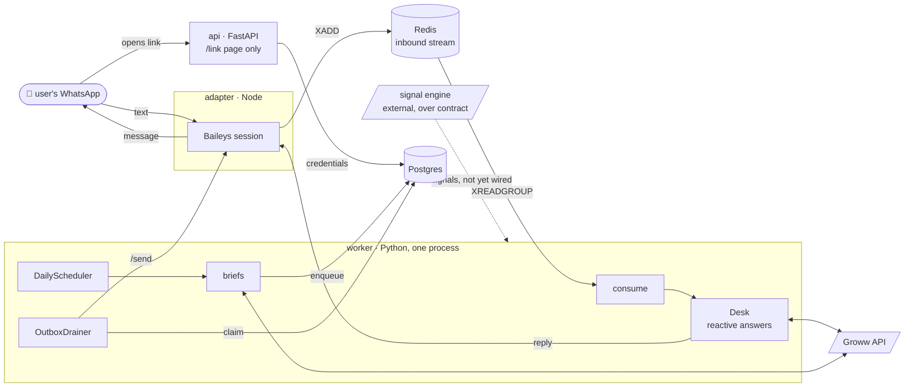
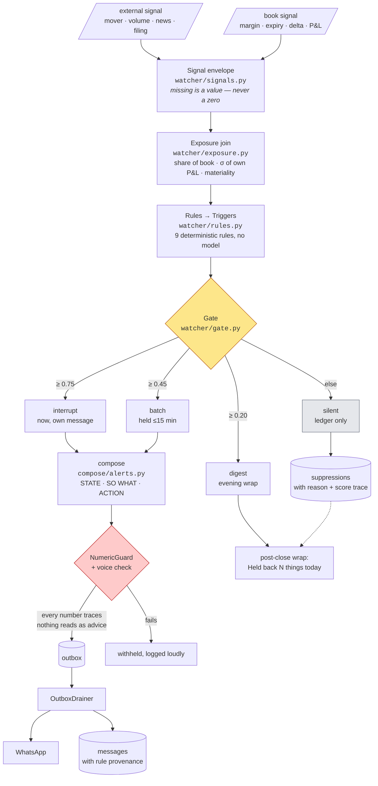
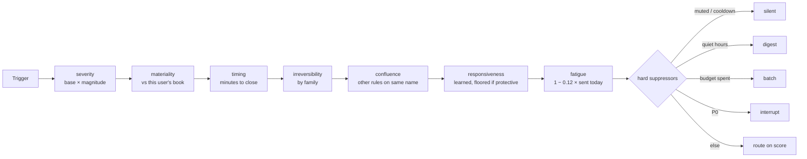
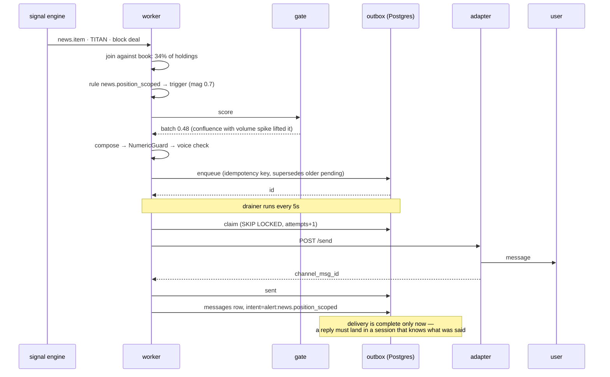

# GR-2 · Groww desk

A WhatsApp number you can text about your money — and which texts you first
when something in your own book changes. Holdings, positions, orders, margin,
live prices on request; a pre-market brief and a post-close wrap on schedule;
intraday nudges through a gate that mostly says no.

Order placement is out of scope. Insight does all the work.

**New here?** Read this page, then [`docs/GR2_MEMO.md`](docs/GR2_MEMO.md) for
the *why*, then [`docs/QUICKSTART.md`](docs/QUICKSTART.md) to run it.

---

## How the pieces fit



Three processes, not four. A separate watcher was designed and then dropped:
with signals arriving over poll and ten users, it would be a second deployable
and a cross-process token-sharing problem for no payer. The seam to split later
is `_run_schedule` and `_drain_outbox` in [`app/worker.py`](app/worker.py).

---

## The decision pipeline

This is the part to understand. Everything else is plumbing around it.



**Why the join is the product.** An external engine can say TITAN fell 3.2% on
four times normal volume. Only we know the user holds 40 shares at ₹2,618, that
it is 34% of their book, and that a 3.2% day is unremarkable for them. The same
signal is an interruption for one person and noise for another.

**Why the gate scores instead of asking a model.** OpenPoke — an open
reimplementation of a well-regarded assistant — decides whether to interrupt you
with one LLM call returning a boolean. On a public benchmark of 71 assistants it
scores 7 on proactivity and **2 on restraint**. That benchmark's anchor for a 3
is *"acts on everything, or on nothing"* — silence and spam score the same.
Details: [`docs/research/GR2_SCORECARD_FINDINGS.md`](docs/research/GR2_SCORECARD_FINDINGS.md).

### Inside the gate

Seven multiplicative stages, every one recorded in `score_trace` — tuning needs
to know *which* stage let something through, not that the total was 0.78.



Two rules the learning loop is not allowed to break, both in
[`watcher/gate.py`](app/watcher/gate.py):

- **A protective family (margin, expiry, structure) is floored at 0.5
  responsiveness.** Someone ignoring margin warnings is the last person whose
  margin warnings should be suppressed.
- **A maximal protective trigger is P0 regardless of base severity.** Found by
  the restraint fixture on its first run: without it, a *critical* margin band
  in quiet hours was deferred to the morning digest.

### One signal, end to end



---

## The five invariants

Set before the first line of code. Nothing has been allowed to break them.

| # | Rule | Enforced by |
|---|---|---|
| I1 | **Numbers never originate in the model.** | [`compose/guard.py`](app/compose/guard.py) — every numeric token in a message must trace to a tool value, or the message is withheld. It has caught a hardcoded constant in our own template. |
| I2 | **The model is not in the detection loop.** | Rules, exposure and gate are arithmetic. `app/agent/` does not exist yet. |
| I3 | **The chat channel is a surface, never a credential.** | Credentials on a signed link page, AES-256-GCM at rest ([`auth/`](app/auth/)). Identity anchors on the brokerage account, not the phone number ([`channel/identity.py`](app/channel/identity.py)). |
| I4 | **TOTP, not the API-key flow.** | [`auth/broker.py`](app/auth/broker.py). The only auth path that can run unattended. |
| I5 | **Fail loudly.** | A missing quote is named as missing, never zeroed. `Signal.number()` returns `None`, `require()` raises. |

Plus one the domain adds: **describe, do not prescribe** —
[`compose/voice.py`](app/compose/voice.py) rejects advice-shaped phrasing the
same way the guard rejects an untraceable number.

---

## Module map

Grouped by layer. Line counts so you know where the weight is.

```
app/
│
├── ── inbound ───────────────────────────────────────────────────
├── worker.py            422  dedupe · debounce · Worker · consume · process entrypoint
├── router/fastpath.py   149  regex intent classifier, 22 intents off the model
├── router/prefs.py      117  pause · snooze · brief at 8:15 — parsed before classify
├── dispatch.py          157  Desk: route → tools → typed object → template
│
├── ── the book (what the user has) ──────────────────────────────
├── book.py              126  one priced read of holdings + positions, for desk and briefs
├── tools/groww.py       262  cached, rate-limited, batched SDK wrappers
├── tools/pnl.py         233  P&L arithmetic — see "numbers the broker won't give you"
├── tools/types.py       388  typed objects every tool returns
├── tools/instruments.py 600  136k-row instrument master + fuzzy resolver
├── tools/aliases.py      95  Hinglish and commodity aliases
│
├── ── the decision pipeline ─────────────────────────────────────
├── watcher/signals.py   199  canonical inbound envelope (docs/SIGNAL_CONTRACT.md)
├── watcher/exposure.py  198  the join: share of book, σ, materiality
├── watcher/rules.py     500  9 rules on a declarative DSL
├── watcher/gate.py      238  seven stages, four routes, two floors
├── compose/alerts.py    214  STATE · SO WHAT · ACTION templates
├── compose/guard.py     119  NumericGuard (I1)
├── compose/voice.py      60  the voice contract + advice check
├── outbox.py            223  state machine + Drainer; per-family retry on ambiguity
│
├── ── scheduled ────────────────────────────────────────────────
├── watcher/briefs.py    378  pre-market · post-close · job registry
├── watcher/schedule.py  159  slot-ledger scheduler: at-most-once across a crash
├── watcher/shadow.py    176  run everything, send nothing, log to a local file
│
├── ── built, not yet wired (await the signal poll) ─────────────
├── watcher/notepad.py    62  per-job cursors with byte caps
├── watcher/suggestions.py 144  "want me to watch TITAN?" — consent-first, capped at 5
├── obs/incidents.py     128  our own failures, paged once per signature
│
├── ── infrastructure ───────────────────────────────────────────
├── store/db.py          647  Postgres, plain psycopg; schema.sql + schema_phase2.sql
├── infra.py             152  Redis cache, per-type-group rate limiter, circuit breaker
├── auth/                195  AES-256-GCM envelope · TOTP token broker
├── channel/             284  Channel protocol · Baileys client · console · identity
├── market/calendar.py   219  NSE/BSE/MCX hours, holidays, session state
├── render/              354  Indian digit grouping, six-line templates, pref replies
├── config.py             89  settings, rate-limit table, log redaction
└── main.py              208  FastAPI: /health and the signed /link page

adapter/index.ts         269  Baileys ↔ Redis bridge. Owns the WhatsApp session, nothing else.
```

**Reading order if you have an hour:** `watcher/gate.py` → `watcher/rules.py` →
`watcher/exposure.py` → `compose/guard.py` → `outbox.py`. That is the product.
The rest you can read when you need it.

---

## Running and testing

Setup, fresh clone to a message on your phone:
**[`docs/QUICKSTART.md`](docs/QUICKSTART.md)**. `make doctor` checks every
prerequisite and prints the fix for each failure.

```bash
make test        # 445 unit tests — hand-written fakes, no DB, no network
make eval        # golden set: intent accuracy, numeric exactness (100% or ship-blocked)
make smoke-db    # the Store against a REAL Postgres — this has caught bugs fakes cannot
make shadow      # today's would-have-sent report
make replay      # re-run a recorded day through the current gate
```

Four kinds of test, and the reason each exists:

| Kind | Where | Catches |
|---|---|---|
| Unit, with fakes | `tests/` | policy and arithmetic |
| Golden set | `eval/` | a rendered number ≠ an independently computed one |
| **Real Postgres** | `scripts/smoke_db.py` | SQL bugs — found the outbox superseding its only pending row, and a timestamptz/naive crash |
| **Restraint fixture** | `tests/test_restraint.py` | routing — one evening, three signals, exactly one should interrupt. Found the P0 gap above |

---

## Numbers the broker won't give you

Groww's holdings payload has **no LTP and no current value**. Its positions
payload has `realised_pnl` but **no unrealised P&L and no LTP**. Every P&L
figure this desk shows is computed in [`tools/pnl.py`](app/tools/pnl.py) by
joining position state to a live quote. Things that bite:

- **Holdings carry no exchange field.** The `NSE_RELIANCE` key for `get_ltp` is
  rebuilt from the instrument master — NSE first, BSE fallback.
- **F&O quantities are units, not lots.** Never multiply by lot size for P&L.
- **`credit_price` / `debit_price` are ambiguous** — per-unit average or
  whole-leg notional. Getting it backwards scales every F&O number by the lot
  size. Isolated behind `Basis`, and **unresolved until `make reconcile` runs
  against a live book.** Do that before anyone else sees numbers.

The instrument master (`data/instruments.csv`, 136,779 rows) refreshes at 07:30
IST as a scheduler job. Its resolver collapses dual listings on ISIN, keeps
commodity aliases off the equity table ("chandi" is never the NSE stock called
SILVER), and sends a list rather than guessing when the top two candidates are
close.

---

## What is not built

Said plainly, because a reader who finds these out from the code trusts the
README less.

- **Intraday alerts do not fire.** Rules, gate and composer are built and
  tested; nothing polls the signal engine yet. Briefs work.
- **The wrap's "Held back N things" reads a table nothing writes yet.** Same
  day as the poll.
- **`app/agent/` is empty.** No LLM path. `why is silver up` gets the
  out-of-scope line.
- **Festival holidays are missing** from `market/holidays.json`. A brief will
  fire on Diwali until someone pastes the NSE list. The file reloads on save.
- **Security was deferred** to reach dogfooding. The link page is plain HTTP
  on a LAN address. Fine for ten internal users on a known network.
- **Every `Store` method blocks the event loop** — sync psycopg behind
  `async def`. Fine at ten users; the pool refactor is planned.

---

## Docs

| | |
|---|---|
| [`docs/GR2_MEMO.md`](docs/GR2_MEMO.md) | Two pages: the product calls and engineering decisions, for someone with no context |
| [`docs/QUICKSTART.md`](docs/QUICKSTART.md) | Setup, verification, what breaks and why |
| [`docs/SIGNAL_CONTRACT.md`](docs/SIGNAL_CONTRACT.md) | The negotiated contract with the signal engine (v0.3) |
| [`docs/research/`](docs/research/) | How the transfer plan, the scorecard study and the contract negotiation went. Reference, not living docs |
